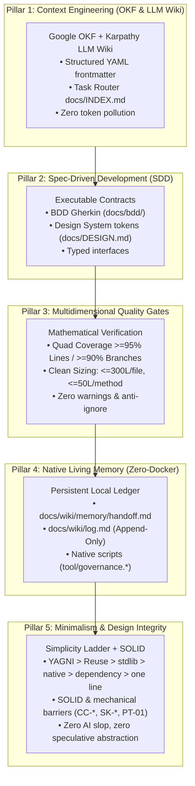

# The OAEF Manifesto: Software Engineering in the Age of AI
> *«The repository that writes its own memory for whoever arrives next.»*  
> **Author & Creator:** Felipe Carvalho  
> **Version:** 1.1.0 — October 2026  
> **License:** Apache License 2.0  

---

## 1. For Non-Technical Stakeholders (Founders, Executives & Product Leaders)

### The Universal Crisis in Digital Engineering
In traditional software development, the single most valuable asset of any organization — its **engineering intelligence and institutional memory** — is also its most fragile. Historically, this knowledge fragments across three ephemeral silos:
1. **In People's Heads**: When a senior software engineer leaves the team, months of unwritten architectural trade-offs and domain knowledge vanish with them;
2. **In Chat Threads**: Critical business rules decided during Slack or Zoom calls are rarely recorded where the actual code lives;
3. **In Opaque Code**: The application runs, but nobody understands *why* it was built that way, leading to fear of modification, ballooning maintenance costs, and slow delivery cycles.

### The Risk of Ungoverned Generative AI
With generative AI coding assistants (Claude Code, Codex, OpenCode, Antigravity, Cursor, Windsurf, Copilot), typing speed has accelerated tenfold. However, when an autonomous AI is tasked with coding without strict architectural guardrails:
* It generates **architectural debt**: Solving immediate bugs while creating five invisible systemic flaws;
* It **invents rogue patterns**: Creating buttons outside brand design systems and neglecting translations or accessibility;
* It **hallucinates business logic**: Deducing domain assumptions that contradict the company's real-world business models.

### The OAEF Solution: The Self-Explaining Living Repository
OAEF transforms a passive codebase into an **active, self-explaining living organism**. It stores not merely compiler instructions, but its own architectural intent, its business specifications, and its inter-session memory.

> **What does this deliver for the business?**
> 1. **Zero-Day Onboarding**: Any new engineer — whether a human hire or a next-generation AI model — reads the structured context and delivers production-grade code on Day 1 without requiring hand-holding;
> 2. **Velocity Without Regressions**: Automated mathematical Quality Gates ensure that zero code reaches production unless its behavior is proven through automated tests;
> 3. **Organizational Independence**: The company is never held hostage by individual developers or third-party vendors. The intelligence belongs permanently to the repository itself.

---

## 2. For Technical Stakeholders (Architects, Tech Leads & Engineers)

### The Inviolable Trust Hierarchy
In an agent-assisted ecosystem, model hallucinations and ungrounded intuitions are critical failure modes. OAEF replaces arbitrary opinions with an unambiguous, mathematical hierarchy of truth:

$$\mathbf{Compiler / Typechecker} > \mathbf{Automated Tests} > \mathbf{Source Code} > \mathbf{Wiki / Docs} > \mathbf{Ephemeral Memory} > \mathbf{LLM Hallucination}$$

* If documentation states one thing and the **compiler** rejects it, the documentation is incorrect;
* If code passes static analysis but an automated **test** fails, the code is incorrect;
* An AI agent MUST NEVER guess what the compiler or test suite can deterministically prove.

---

### The 5 Architectural Pillars

#### 1. Context Engineering (Google OKF & Karpathy LLM Wiki)
Static PDFs and neglected wikis fail because they live apart from the code.
* **Open Knowledge Format (OKF)**: Every core document features structured YAML metadata consumable by language models.
* **LLM Wiki Architecture (Andrej Karpathy)**: Clear separation between raw knowledge, synthesized concepts, and automated integrity linters.
* **Context Routing (`docs/INDEX.md`)**: Agents read a lightweight routing matrix to load only the 500 tokens necessary for a task, avoiding context saturation.
* **Standard Discovery (`/llms.txt`)**: Provides a universal machine-readable entry point for modern AI tools.

#### 2. Spec-Driven Development (SDD)
Specifications govern implementation through isolated executable contracts:
* **Behavior**: BDD Gherkin scenarios in `docs/bdd/*.feature`;
* **Interface**: Design System contracts and tokens in `docs/DESIGN.md`;
* **Decisions**: Architecture Decision Records (ADR) capturing immutable rationale.

#### 3. Multidimensional Quality Gates
Code quality is not a matter of subjective code review opinions; it is an algorithmic measurement:
* **Quad Coverage**: Mínimum 95% Lines and 90% Branches, verifying error pathways and fallbacks;
* **Duplication**: Maximum 3.0% across the codebase and zero duplicated blocks >= 15 lines;
* **Clean Sizing**: Maximum 300 physical lines per file and 50 physical lines per function, forcing modular decomposition;
* **Zero Suppressions**: Zero errors, zero warnings, and a strict ban on `// ignore` statements;
* **The Monotonic Ratchet**: Quality metrics can only move upwards over time.

#### 4. Continuous Memory & Zero-Docker Philosophy
* **Session Handoff**: Inter-session memory lives natively in `docs/wiki/memory/handoff.md` and `docs/wiki/log.md`.
* **Zero Ghost Complexity**: No slow Docker containers, no heavy vector databases, and no background daemons. All validation runs natively in the project's own language within milliseconds.

#### 5. Minimalism & Design Integrity (Simplicity Ladder + SOLID)
The best code is the code you did not have to write. Before any implementation the agent climbs the **Simplicity Ladder (the Ponytail Ladder)**: YAGNI > reuse in codebase > language/stdlib primitives > platform-native capability > already-installed dependency > one-line idiomatic expression > smallest correct diff. Alongside it, **SOLID** keeps every class, module, service and component under single responsibility, segregated contracts, inverted dependencies and strict substitutability. Ceremonial layers, speculative abstraction and AI slop are rejected by design, while the safety frontier (input validation, error routing, privacy/consent, accessibility and every Quality Gate) is never pruned. See [`docs/standards/clean_code.md`](templates/base/docs/standards/clean_code.md) and [`docs/standards/solid.md`](templates/base/docs/standards/solid.md).

#### Governance Checks (Mechanical Enforcement)
Minimalism and design integrity are enforced mechanically in all 12 supported stacks, not left to reviewer taste. Every governance runtime implements the normative catalog in [`docs/standards/governance_checks.md`](templates/base/docs/standards/governance_checks.md): the `CC-*` clean-code barriers (naming, non-nullable collections, service-locator confinement, silent exception swallowing, unimplemented placeholders, dependency-inversion leaks, hot-path allocation), the `SK-*` skill-activation invariants (parity, frontmatter quality, trigger coherence, harness mirror parity, routing self-test) and the report-only `PT-01` simplicity-debt markers. Findings print as `<CHECK-ID> <path>:<line> — <message>`; under the `strict` profile they block the build (`oaef clean-code`), while `standard` and adoption modes report them as advisory except `CC-04` (hardcoded secrets) and `SK-05` (mirror divergence), which block under every profile.

---

## 3. The Non-Negotiable Commitment

> *«Any software engineer or AI agent contributing to an OAEF repository agrees to be evaluated by the same Quality Gates, to specify behavior before implementation, to respect architectural boundaries, and to leave the repository in a cleaner state than when it was found.»*
