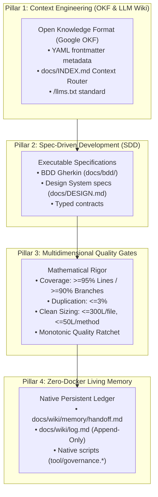

# Open Agentic Engineering Framework (OAEF)

[](SPECIFICATION.md)
[](LICENSE)
[](MANIFESTO.md)
[](#)
[](templates/base/AGENTS.md)

> **The open-source standard for living, self-verifying, and context-engineered software repositories operated by autonomous AI agents and human engineers.**  
> **Created and authored by [Felipe Carvalho](NOTICE).**

---

## ⚡ The Core Problem OAEF Solves

Generative AI coding assistants (Claude Code, Google Antigravity, Cursor, Windsurf, Copilot) write code 10x faster than humans. However, when deployed in unregulated repositories, they produce:
1. **Spaghetti Code & Architectural Drift**: Generating inconsistent patterns, violating layer boundaries, and inflating file size;
2. **Context Blindness & Token Waste**: Flooding context windows with thousands of irrelevant tokens or hallucinating missing files;
3. **Silent Assumption Disasters**: Silently guessing business logic or resolving contradictions without human validation;
4. **Fragile Ephemeral Memory**: Losing critical reasoning and architectural context as soon as a chat session ends.

**OAEF transforms any codebase into a Living Repository** — a self-documenting, mathematically audited system that enforces strict architectural boundaries, maintains persistent inter-session memory, and eliminates token bloat without requiring Docker containers or heavy vector databases.

---

## 🏛️ The Inviolable Trust Hierarchy

OAEF establishes a strict mathematical hierarchy of truth:

$$\mathbf{Compiler / Typechecker} > \mathbf{Automated Tests} > \mathbf{Source Code} > \mathbf{Wiki / Docs} > \mathbf{Ephemeral Memory} > \mathbf{LLM Hallucination}$$

| Trust Level | Source of Truth | Required Behavior |
| :--- | :--- | :--- |
| **1. Inviolable** | Compiler & Typechecker | If the compiler or static analyzer fails, the code is incorrect. Zero suppressions. |
| **2. Deterministic** | Automated Tests | Tests validate behavior and contracts. Failing tests supersede assumptions. |
| **3. Factual** | Committed Source Code | What is committed and executing supersedes outdated prose. |
| **4. Referential** | Living Docs & ADRs | Specifications and ADRs document architectural intent. |
| **5. Volatile** | Ephemeral Memory (`handoff.md`) | Inter-session notes provide short-term context between agents. |
| **6. Void** | LLM Hallucination | Assumptions without grounding in code, compiler, or tests must be discarded. |

---

## 🧱 The 4 Pillars of OAEF



---

## ⏱️ 60-Second Quickstart Demo

Experience how OAEF initializes and audits a project in 60 seconds:

```bash
# 1. From inside the OAEF directory, initialize a sandbox project:
mkdir -p /tmp/oaef-demo
./install.sh --target /tmp/oaef-demo --stack universal --strict --non-interactive

# 2. Inspect the generated living repository structure:
cd /tmp/oaef-demo && ls -la docs/ .agents/skills/
cat oaef.context.json
```

---

## 🌐 12 Supported Tech Stacks (Full Parity)

OAEF includes idiomatic, stack-adaptive agent skills and native governance engines for:

1. **Dart / Flutter** (`flutter test`, `bloc_test`, `mocktail`, AST sizing)
2. **React Native** (Fabric, TurboModules, `jest`, `eslint`, React Native styles)
3. **Expo** (Expo Router, Managed Workflow, `expo-doctor`, `jest`)
4. **TypeScript / Web** (React, Next.js, Node.js, `vitest`, `eslint`)
5. **Kotlin Multiplatform (KMP)** (Compose Multiplatform, `kotlin.test`, `kover`)
6. **Kotlin / Android** (Jetpack Compose, Android SDK, `JUnit 5`, `Detekt`, `JaCoCo`)
7. **Python** (FastAPI, Django, `pytest`, `pytest-cov`, `ruff`, `mypy`)
8. **Go (Golang)** (Microservices, `go test`, `golangci-lint`)
9. **Rust** (Systems, `cargo test`, `cargo clippy`, `cargo-tarpaulin`)
10. **Swift / iOS** (iOS, macOS, `XCTest`, `Swift Testing`, `SwiftLint`)
11. **C# / .NET** (ASP.NET Core, `xUnit`, `Coverlet`, Roslyn analyzers)
12. **Universal / Polyglot** (POSIX Shell portable engine)

---

## 📦 What's Inside a Project with OAEF?

When installed in a repository, OAEF establishes:

- [`AGENTS.md`](templates/base/AGENTS.md): The canonical working contract for all AI coding agents and human engineers.
- [`CLAUDE.md`](templates/base/CLAUDE.md): Protected mirror for Claude Code with automated parity sync.
- [`llms.txt`](templates/base/llms.txt): Machine-readable semantic discovery file for LLMs.
- `docs/INDEX.md`: Task-based OKF router saving thousands of tokens per agent interaction.
- `docs/MANIFESTO.md`: Dual-audience charter aligning business leadership and technical staff.
- `docs/wiki/metrics/baseline.json`: Mathematical quality gate thresholds with the Monotonic Ratchet.
- `docs/wiki/memory/handoff.md`: Inter-session memory ledger with multi-agent concurrency shielding.
- `docs/wiki/log.md`: Immutable append-only historical logbook.
- `.agents/skills/`: 10 stack-tailored agent skills providing deterministic instructions.
- `tool/governance.*`: Zero-Docker native CLI script for linting, quality gates, and parity audits.
- `.github/`: Open-source community PR template, Issue templates (bugs, features, ADRs), and stack-tailored CI workflows.
- `CONTRIBUTING.md` & `SECURITY.md`: Canonical contribution guidelines and vulnerability disclosure policy.

---

## 📖 Documentation Index

- [**Installation Guide (`INSTALL.md`)**](INSTALL.md) — 3 frictionless adoption paths (Interactive Wizard, Agent CLI, 1-Prompt Recipe).
- [**1-Prompt Agent Adoption Recipe (`ADOPTION_PROMPT.md`)**](ADOPTION_PROMPT.md) — Copy-paste prompt for chat interfaces.
- [**Official Specification (`SPECIFICATION.md`)**](SPECIFICATION.md) — Formal RFC specification of OAEF v1.0.0.
- [**Dual Manifesto (`MANIFESTO.md`)**](MANIFESTO.md) — Business ROI and architectural rationale.
- [**Contributor Guidelines (`CONTRIBUTING.md`)**](CONTRIBUTING.md) — Contribution workflow, Clean Code standards, and PR protocol.
- [**Security Policy (`SECURITY.md`)**](SECURITY.md) — Vulnerability reporting and memory secret scanning.
- [**License & Attribution (`NOTICE`)**](NOTICE) — Apache 2.0 and foundational citations.

---

## 📜 Foundational Citations & Credits

OAEF was created by **Felipe Carvalho** and synthesizes key breakthroughs in modern software engineering:
- **Andrej Karpathy**: *LLM Wiki Concept* (Continuous maintenance & structured synthesis).
- **Google**: *Open Knowledge Format (OKF)* (Semantic YAML frontmatter metadata).
- **Jeremy Howard / Answer.ai**: */llms.txt Standard* (Machine-friendly token navigation).
- **Very Good Ventures (VGV)**: *Strict Linting & 100% Coverage Culture*.
- **Robert C. Martin (Uncle Bob)**: *Clean Code Craftsmanship* (Meaningful names, ban on abbreviations/flag arguments, clean sizing).
- **Michael Nygard**: *Architecture Decision Records (ADR)*.
- **Dan North & Martin Fowler**: *Behavior-Driven Development (BDD)*.
- **Cyrille Martraire**: *Living Documentation*.

---

## 📄 License

Licensed under the **Apache License, Version 2.0**. Commercial use is fully permitted provided author attribution to **Felipe Carvalho** and the [NOTICE](NOTICE) file are retained in all distributions.
