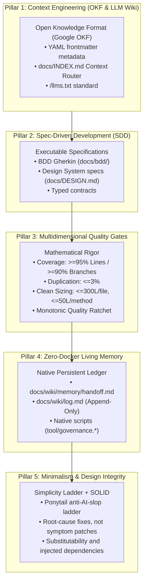

# Open Agentic Engineering Framework (OAEF)

[](SPECIFICATION.md)
[](LICENSE)
[](MANIFESTO.md)
[](#)
[](templates/base/docs/HARNESSES.md)

> **The open-source standard for living, self-verifying, and context-engineered software repositories operated by autonomous AI agents and human engineers.**  
> **Created and authored by [Felipe Carvalho](NOTICE).**

---

## The Core Problem OAEF Solves

Generative AI coding assistants (Claude Code, Codex, OpenCode, Antigravity, Cursor, Windsurf, Copilot) write code 10x faster than humans. However, when deployed in unregulated repositories, they produce:
1. **Spaghetti Code & Architectural Drift**: Generating inconsistent patterns, violating layer boundaries, and inflating file size;
2. **Context Blindness & Token Waste**: Flooding context windows with thousands of irrelevant tokens or hallucinating missing files;
3. **Silent Assumption Disasters**: Silently guessing business logic or resolving contradictions without human validation;
4. **Fragile Ephemeral Memory**: Losing critical reasoning and architectural context as soon as a chat session ends.

**OAEF transforms any codebase into a Living Repository** — a self-documenting, mathematically audited system that enforces strict architectural boundaries, maintains persistent inter-session memory, and eliminates token bloat without requiring Docker containers or heavy vector databases.

---

## The Inviolable Trust Hierarchy

OAEF establishes a strict mathematical hierarchy of truth:

$$\mathbf{Compiler / Typechecker} > \mathbf{Automated Tests} > \mathbf{Source Code} > \mathbf{Wiki / Docs} > \mathbf{Ephemeral Memory} > \mathbf{LLM Hallucination}$$

| Trust Level | Source of Truth | Required Behavior |
| :--- | :--- | :--- |
| **1. Inviolable** | Compiler & Typechecker | If the compiler or static analyzer fails, the code is incorrect. Zero suppressions. |
| **2. Deterministic** | Automated Tests | Tests validate behavior and contracts. Failing tests supersede assumptions. |
| **3. Factual** | Committed Source Code | What is committed and executing supersedes outdated prose. |
| **4. Referential** | Living Docs & ADRs | Specifications and ADRs document architectural intent. |
| **5. Volatile** | Ephemeral Memory (`handoff.md`) | Inter-session notes provide short-term context between agents. |
| **6. Void** | LLM Hallucination | Assumptions without grounding in code, compiler, or tests must be discarded. |

---

## The 5 Pillars of OAEF



**Pillar 5 — Minimalism & Design Integrity (Simplicity Ladder + SOLID)** sits on top of the four foundational pillars: every artifact is first climbed down the Simplicity Ladder (YAGNI > reuse > stdlib > platform-native > installed dependency > one-line idiom > smallest correct diff) and only then shaped under SOLID. The best code is the code you did not have to write; speculative abstraction and AI slop are rejected by policy, and each deliberate simplification is declared with a `// ponytail:` debt marker.

---

## Agent Harness Compatibility (August 2026)

OAEF is **harness-native**: the canonical `AGENTS.md` contract and the portable `.agents/skills/` catalog are the open standards consumed directly by the leading coding harnesses — **no per-tool rewriting required**.

### Tier 1 Spotlight

| Harness | Vendor | License | Native instruction file | OAEF integration |
| :--- | :--- | :--- | :--- | :--- |
| **Claude Code** | Anthropic | Proprietary | `CLAUDE.md` (reads `AGENTS.md` as fallback since v2.1.277) | `CLAUDE.md` mirror kept in parity by `oaef sync` |
| **Codex** | OpenAI | Apache-2.0 | `AGENTS.md` | Native (contract + `.agents/skills/`) |
| **OpenCode** | Anomaly | MIT | `AGENTS.md` | Native (contract + `.agents/skills/`) |
| **Antigravity** (`agy`) | Google | Proprietary | `AGENTS.md` / `GEMINI.md` | Native (contract + `.agents/skills/`) |
| **Cursor** | Anysphere | Proprietary | `AGENTS.md` + `.cursor/rules/` | Native (contract + `.agents/skills/`) |

Plus **Pi**, **Cline**, **Qwen Code**, **Goose**, **DeepSeek Harness**, **OpenHands**, **Aider**, **Zed Agent**, **Grok Build**, **GitHub Copilot CLI**, **Windsurf**, **Hermes Agent**, **Factory Droid**, **Jules**, **Amp** and more — **20+ harnesses** in total. The full verified matrix (instruction files, skills directories, and integration status per tier) lives in [`docs/HARNESSES.md`](templates/base/docs/HARNESSES.md).

> **Standard foundation**: `AGENTS.md` is stewarded by the **Agentic AI Foundation (Linux Foundation)** and used by 60,000+ open-source projects; `.agents/skills/` is the cross-harness skill convention. Gemini CLI was retired for personal accounts on **18 June 2026** and succeeded by Antigravity CLI (`agy`).

---

## 60-Second Quickstart Demo

Experience how OAEF initializes and audits a project in 60 seconds:

```bash
# 1. From inside the OAEF directory, initialize a sandbox project:
mkdir -p /tmp/oaef-demo
./install.sh --target /tmp/oaef-demo --stack universal --strict --non-interactive

# 2. Inspect the generated living repository structure:
cd /tmp/oaef-demo && ls -la docs/ .agents/skills/
cat oaef.context.json
```

---

## 12 Supported Tech Stacks (Full Parity)

OAEF includes idiomatic, stack-adaptive agent skills and native governance engines for:

1. **Dart / Flutter** (`flutter test`, `bloc_test`, `mocktail`, AST sizing)
2. **React Native** (Fabric, TurboModules, `jest`, `eslint`, React Native styles)
3. **Expo** (Expo Router, Managed Workflow, `expo-doctor`, `jest`)
4. **TypeScript / Web** (React, Next.js, Node.js, `vitest`, `eslint`)
5. **Kotlin Multiplatform (KMP)** (Compose Multiplatform, `kotlin.test`, `kover`)
6. **Kotlin / Android** (Jetpack Compose, Android SDK, `JUnit 5`, `Detekt`, `JaCoCo`)
7. **Python** (FastAPI, Django, `pytest`, `pytest-cov`, `ruff`, `mypy`)
8. **Go (Golang)** (Microservices, `go test`, `golangci-lint`)
9. **Rust** (Systems, `cargo test`, `cargo clippy`, `cargo-tarpaulin`)
10. **Swift / iOS** (iOS, macOS, `XCTest`, `Swift Testing`, `SwiftLint`)
11. **C# / .NET** (ASP.NET Core, `xUnit`, `Coverlet`, Roslyn analyzers)
12. **Universal / Polyglot** (POSIX Shell portable engine)

---

## What's Inside a Project with OAEF?

When installed in a repository, OAEF establishes:

- [`AGENTS.md`](templates/base/AGENTS.md): The canonical working contract for all AI coding agents and human engineers, consumed natively by 20+ harnesses (Codex, OpenCode, Antigravity, Cursor, Pi, and others).
- [`CLAUDE.md`](templates/base/CLAUDE.md): Protected mirror for Claude Code with automated parity sync.
- [`llms.txt`](templates/base/llms.txt): Machine-readable semantic discovery file for LLMs.
- [`docs/HARNESSES.md`](templates/base/docs/HARNESSES.md): Verified agent harness compatibility matrix (Tier 1–3, August 2026) with instruction-file and skills support.
- `docs/INDEX.md`: Task-based OKF router saving thousands of tokens per agent interaction.
- `docs/MANIFESTO.md`: Dual-audience charter aligning business leadership and technical staff.
- `docs/wiki/metrics/baseline.json`: Mathematical quality gate thresholds with the Monotonic Ratchet.
- `docs/wiki/memory/handoff.md`: Inter-session memory ledger with multi-agent concurrency shielding.
- `docs/wiki/log.md`: Immutable append-only historical logbook.
- `.agents/skills/`: 13 stack-tailored agent skills providing deterministic instructions, auto-discovered natively by Codex, OpenCode, Antigravity, Cursor, Windsurf, and other harnesses (mirrored into harness-specific directories; see [Skill Activation & Harness Mirrors](#skill-activation--harness-mirrors)).
- `tool/governance.*`: Zero-Docker native CLI script for linting, quality gates, and parity audits.
- `.github/`: Open-source community PR template, Issue templates (bugs, features, ADRs), and stack-tailored CI workflows.
- `CONTRIBUTING.md` & `SECURITY.md`: Canonical contribution guidelines and vulnerability disclosure policy.

---

## Canonical catalog of 13 Agent Skills

The framework fixes its stack-adaptive skill catalog at 13 skills. Every skill lives in `.agents/skills/<name>/SKILL.md` and is consumed natively by `AGENTS.md`-aware harnesses.

| Skill | Purpose |
| :--- | :--- |
| `ponytail` | Simplicity ladder, anti-AI-slop, root-cause fixes and debt markers. |
| `nullable-types` | Strict, defensive null-safety and guard clause patterns. |
| `architecture-audit` | Verify module decoupling, boundaries, and sizing bounds. |
| `screen-builder` | Vertical feature construction respecting Clean Sizing. |
| `component-author` | Modular component authoring following Design System tokens. |
| `responsive-layout` | Adaptive surfaces across breakpoints, form factors and payload shapes. |
| `ui-preview` | Isolated component previews and rapid feedback. |
| `fix-layout-issues` | Structural layout and UI rendering debugging. |
| `test-generator` | High-coverage unit, integration, and branch testing. |
| `collect-coverage` | Native coverage extraction and LCOV auditing. |
| `run-static-analysis` | Strict static analysis with zero warnings and auto-fix. |
| `code-review` | Pre-PR self-audit checklist and Quality Gate verification. |
| `conformance-audit` | Repository conformance audit (structure, skills, mirrors, community files). |

### Canonical Skill Chaining Recipes

```text
1. Feature / Screen Construction:
   ponytail -> screen-builder + responsive-layout -> ui-preview -> test-generator -> collect-coverage -> run-static-analysis -> code-review
2. Reusable Component / Module Authoring:
   ponytail -> component-author -> ui-preview -> responsive-layout -> test-generator -> run-static-analysis
3. Bug Fix / Root-Cause Remediation:
   ponytail (root-cause caller grep) -> fix-layout-issues (UI) / nullable-types (logic) -> test-generator -> run-static-analysis
4. Domain, Data & Infrastructure:
   ponytail -> nullable-types -> test-generator -> collect-coverage -> run-static-analysis
5. Pre-Submission / Pull Request Cycle:
   collect-coverage -> run-static-analysis -> code-review
```

---

## Governance Checks

The normative catalog is [`docs/standards/governance_checks.md`](templates/base/docs/standards/governance_checks.md). A compliant OAEF repository enforces the same checks in every stack through its native governance engine:

| Group | Identifiers | Scope |
| :--- | :--- | :--- |
| **Clean Code barriers** | `CC-01` … `CC-11` | Naming, abbreviations, mutable lazy init, placeholder secrets, raw prints, silent exception swallowing, service-locator leakage, nullable collections, unimplemented placeholders, concrete client instantiation, avoidable allocation. |
| **Skill activation invariants** | `SK-01` … `SK-06` | Skill parity, frontmatter quality, entrypoint parity, trigger coherence, harness mirror parity, routing self-test. |
| **Ponytail debt** | `PT-01` | Report-only inventory of `// ponytail:` debt markers. |

Under the `strict` profile the checks are **blocking** (exit code `1` when a blocking check fails); under `standard` and in every adoption mode they are **advisory** (warn-only), with two exceptions that block under every profile: `CC-04` (hardcoded placeholder/secret) and `SK-05` (harness mirror divergence). Findings are printed as `<CHECK-ID> <path>:<line> — <message>`.

```bash
oaef clean-code                       # run the CC-* governance barriers
oaef skills audit                     # SK-01..SK-06 skill activation invariants
oaef skills audit --selftest          # adds the SK-06 routing fixture table
oaef ponytail debt                    # report PT-01 debt markers
```

---

## Skill Activation & Harness Mirrors

The canonical catalog is installed once at `.agents/skills/` and mirrored into every harness that discovers skills from its own directory, so a skill's `description` triggers the harness natively:

| Mirror directory | Harness |
| :--- | :--- |
| `.claude/skills/` | Claude Code |
| `.cursor/rules/` | Cursor Agent CLI |
| `.windsurf/skills/` | Windsurf |
| `.cline/skills/` | Cline |
| `.grok/agents/` | Grok Build |

Mirrors are generated artifacts (symlink or content-hash copy); never edit them in place.

```bash
oaef skills sync-mirrors              # rebuild every harness mirror from .agents/skills/
oaef skills sync-mirrors --check      # validate parity without writing (reports SK-05)
oaef skills audit --selftest          # proves routing: resolves the canonical prompt-to-skill fixtures (SK-06)
```

`oaef skills audit --selftest` is the executable proof that prompt dispatch works without a live harness: each canonical prompt must resolve to its expected skill and chaining recipe. A corrupted mirror is preserved and reported as `SK-05`; pass `--no-mirrors` at install time to skip mirror creation entirely.

---

## Adopting OAEF in an Existing Repository

OAEF is additive for existing repositories — it never rewrites user-owned content.

- `oaef adopt` installs into an existing project (alias `oaef init --legacy`); `oaef upgrade` updates an earlier OAEF installation in place.
- **Section-sentinel merge**: each canonical section is wrapped in `<!-- oaef:section:* -->` … `<!-- /oaef:section:* -->` markers. On adoption and upgrade the framework replaces only the content inside those markers; everything outside them is user-owned and is **never rewritten or deleted**. A `--dry-run` classifies every file as `install`, `merge-additive`, `merge-conflict`, `propose-oaef-new` or `preserve`.
- **Advisory barriers**: in adoption mode every `CC-*` check enters advisory and the measured coverage (lcov/cobertura/jacoco/coverlet) becomes the Monotonic Ratchet floor — quality may only increase.
- **Adoption Debt Ledger**: new-barrier findings are inventoried in `docs/wiki/memory/adoption.md` and `docs/wiki/metrics/adoption.json` — with per-check violations and sizing debt — until they are paid down.

```bash
oaef init --target . --stack auto --legacy --dry-run   # discover non-destructively, write nothing
oaef adopt                                             # apply the additive merge
oaef upgrade                                           # move an existing OAEF install to 1.1.0
```

---

## Documentation Index

- [**Installation Guide (`INSTALL.md`)**](INSTALL.md) — 3 frictionless adoption paths (Interactive Wizard, Agent CLI, 1-Prompt Recipe).
- [**1-Prompt Agent Adoption Recipe (`ADOPTION_PROMPT.md`)**](ADOPTION_PROMPT.md) — Copy-paste prompt for chat interfaces.
- [**Official Specification (`SPECIFICATION.md`)**](SPECIFICATION.md) — Formal RFC specification of OAEF v1.1.0.
- [**Dual Manifesto (`MANIFESTO.md`)**](MANIFESTO.md) — Business ROI and architectural rationale.
- [**Contributor Guidelines (`CONTRIBUTING.md`)**](CONTRIBUTING.md) — Contribution workflow, Clean Code standards, and PR protocol.
- [**Security Policy (`SECURITY.md`)**](SECURITY.md) — Vulnerability reporting and memory secret scanning.
- [**License & Attribution (`NOTICE`)**](NOTICE) — Apache 2.0 and foundational citations.

---

## Foundational Citations & Credits

The **Open Agentic Engineering Framework (OAEF)** was created and authored by **Felipe Carvalho** and synthesizes key breakthroughs in modern software engineering:
- **Andrej Karpathy**: *LLM Wiki Concept* (Continuous maintenance & structured synthesis).
- **Google**: *Open Knowledge Format (OKF)* (Semantic YAML frontmatter metadata).
- **Jeremy Howard / Answer.ai**: */llms.txt Standard* (Machine-friendly token navigation).
- **Very Good Ventures (VGV)**: *Strict Linting & 100% Coverage Culture*.
- **Robert C. Martin (Uncle Bob)**: *Clean Code Craftsmanship* (Meaningful names, ban on abbreviations/flag arguments, clean sizing) and the SOLID principles behind Pillar 5.
- **Dietrich Gebert — Ponytail minimalism**: the Simplicity Ladder that rejects AI slop and speculative abstraction in favor of the smallest correct diff.
- **Michael Nygard**: *Architecture Decision Records (ADR)*.
- **Dan North & Martin Fowler**: *Behavior-Driven Development (BDD)*.
- **Cyrille Martraire**: *Living Documentation*.

All distributions, modifications and derivatives MUST retain the [NOTICE](NOTICE) file and its attribution to **Felipe Carvalho**.

---

## License

Licensed under the **Apache License, Version 2.0**. Commercial use is fully permitted provided author attribution to **Felipe Carvalho** and the [NOTICE](NOTICE) file are retained in all distributions.
